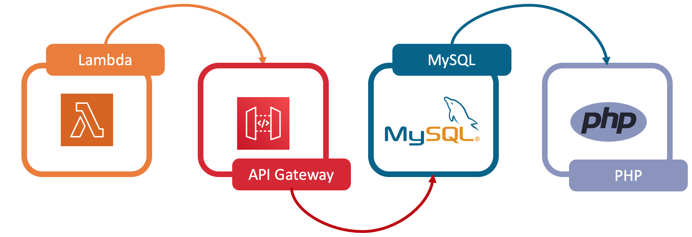

# The Serverless LAMP stack 



## Examples ##
- [0.1-SimplePhpFunction](https://github.com/bls20AWS/serverelss-php/tree/master/0.1-SimplePhpFunction) a very simple implementation of a PHP Lambda function. This uses a custom rumtime bootstrap and vendor dependancies as layers.


## Community Curated PHP / Serverless resources ##

> [serverless-php-resources.md](/serverless-php-resources.md) - A community curated list of PHP / Serverless resources (videos, blogs, code examples frameworks, events). 


## Creating your custom PHP runtime ##
Follow the instructions below to create Lambda layers to hold your PHP custom runtime and library dependancies. Include these layers in your PHP Lambda functions with the Lambda runtime set to `provided`.

### Compiling PHP ###
:information_source: PHP 7.3.0 has been used for this example.

To create a custom runtime, you must first compile the required version of PHP in an Amazon Linux environment compatible with the [Lambda execution environment](https://docs.aws.amazon.com/lambda/latest/dg/current-supported-versions.html). 

Compile PHP by running the following commands:

```bash
# Update packages and install needed compilation dependencies
sudo yum update -y
sudo yum install autoconf bison gcc gcc-c++ libcurl-devel libxml2-devel -y

# Compile OpenSSL v1.0.1 from source, as Amazon Linux uses a newer version than the Lambda Execution Environment, which
# would otherwise produce an incompatible binary.
curl -sL http://www.openssl.org/source/openssl-1.0.1k.tar.gz | tar -xvz
cd openssl-1.0.1k
./config && make && sudo make install
cd ~

# Download the PHP 7.3.0 source
mkdir ~/php-7-bin
curl -sL https://github.com/php/php-src/archive/php-7.3.0.tar.gz | tar -xvz
cd php-src-php-7.3.0

# Compile PHP 7.3.0 with OpenSSL 1.0.1 support, and install to /home/ec2-user/php-7-bin
./buildconf --force
./configure --prefix=/home/ec2-user/php-7-bin/ --with-openssl=/usr/local/ssl --with-curl --with-zlib
make install
```

### Packaging PHP with the Bootstrap file ###

:warning: <font size="2">[This custom runtime bootstrap file](/bootstrap) is for demonstration purposes only. It does not contain any error handling or abstractions.</font>

1. Download this [example bootstrap file](/bootstrap) and save it together with the complied php binary into the following directory structure:
<pre>
+--runtime
|  |-- bootstrap*
|  +-- bin/
|  |   +-- php*
</pre>

2. Package the PHP binary and bootstrap file together into a file named `runtime.zip`:

```bash
zip -r runtime.zip bin bootstrap
```

:information_source: <font size="2">Consult the [Runtime API documentation](https://docs.aws.amazon.com/lambda/latest/dg/runtimes-api.html) as you build your own production custom runtimes to ensure that you’re handling all eventualities as gracefully as possible.</font>

### Creating dependancies ###

[This bootstrap file](/bootstrap) uses [Guzzle](https://github.com/guzzle/guzzle), a popular PHP HTTP client, to make requests to the custom runtime API.  The Guzzle package is installed using [Composer package manager](https://getcomposer.org/).

In an Amazon Linux environment compatible with the [Lambda execution environment](https://docs.aws.amazon.com/lambda/latest/dg/current-supported-versions.html)

1. Install Composer:
```bash
curl -sS https://getcomposer.org/installer | ./bin/php
```
2.  Install Guzzle (and any additional libraries you require):
```bash
./bin/php composer.phar require guzzlehttp/guzzle
```
3. Package the dependancies into a `vendor.zip` binary
```bash
zip -r vendor.zip vendor/
```

### Publish to Lambda layers ###
1.	Use the [AWS Command Line Interface (CLI)](https://aws.amazon.com/cli/) to publish layers from the binaries created earlier. 

```bash
aws lambda publish-layer-version \
    --layer-name PHP-example-runtime \
    --zip-file fileb://runtime.zip \
    --region eu-west-1
```

```bash
aws lambda publish-layer-version \
    --layer-name PHP-example-vendor \
    --zip-file fileb://vendor.zip \
    --region eu-west-1
```
2.	Make note of each command’s LayerVersionArn output value (for example `arn:aws:lambda:eu-west-1:XXXXXXXXXXXX:layer:PHP-example-runtime:1`). You will use this to add the Layers to your PHP Lambda functions.


## Resources
### AWS Blog posts & documentation
* https://aws.amazon.com/blogs/compute/introducing-the-new-serverless-lamp-stack/
* https://aws.amazon.com/blogs/apn/aws-lambda-custom-runtime-for-php-a-practical-example/
* https://docs.aws.amazon.com/lambda/latest/dg/runtimes-api.html

### Open source Lambda layers
* https://bref.sh/
* https://github.com/stackery/php-lambda-layer


## Issue Reporting

If you have found a bug or if you have a feature request, please report them at this repository issues section.

## License

This project is licensed under the MIT license. See the [LICENSE](../LICENSE) file for more info.
